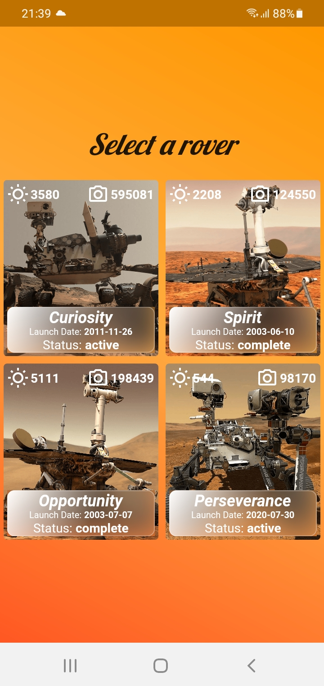
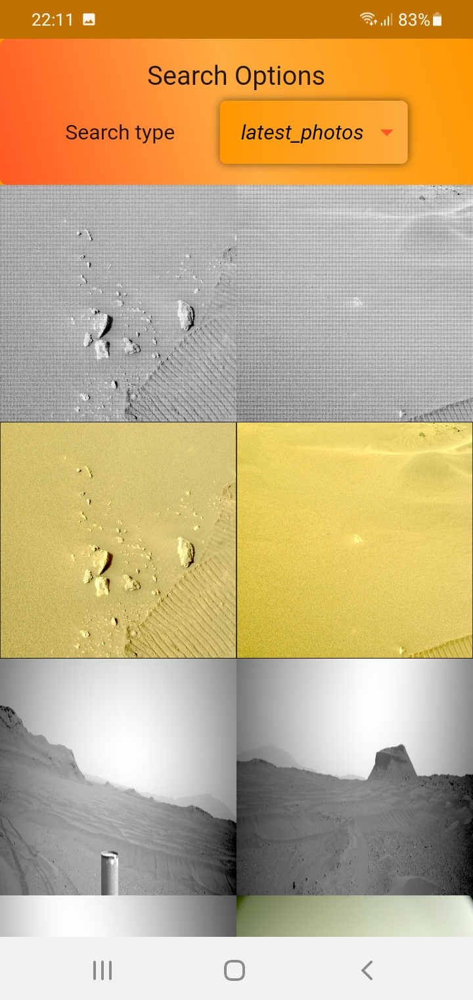
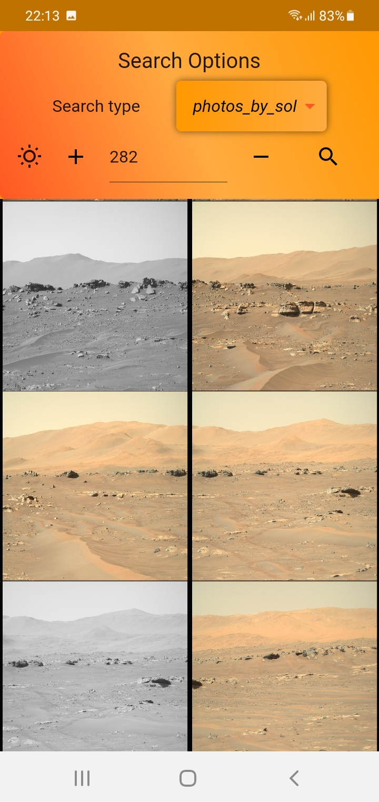
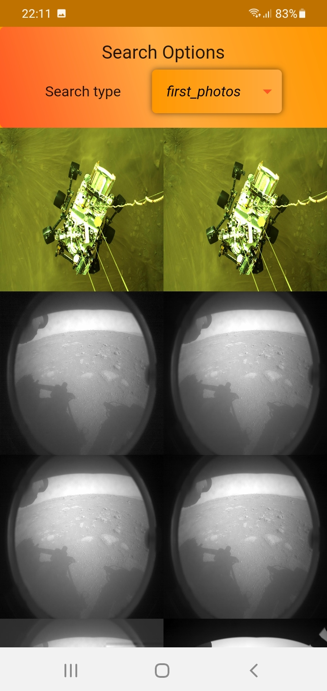

# Mars Rover Photos

Aplicativo feito com o objetivo de vizualizar as fotos dos rovers que estão no planeta Marte.

Utilizando uma API disponibilizada pela NASA, o aplicativo oferece a opção de escolher entre um dos quatro rovers presentes em marte, Spirit, Curiosity, Opportunity e Perseverance.

### * Alguns funcionalidades que o aplicativo possui *

 - Escolher um entre os quatro rovers disponiveis  
 - Buscar as primeiras fotos que o rover enviou, as mais recentes ou de algum sol especifico.  
 - É possivel vizualizar uma foto especifica, dando zoom em alguma parte para assim vizualizar melhor os detalhes presentes.  

<h3> Telas do aplicativo em um celular Sansung A01</h3>

 

 

 

 

 
